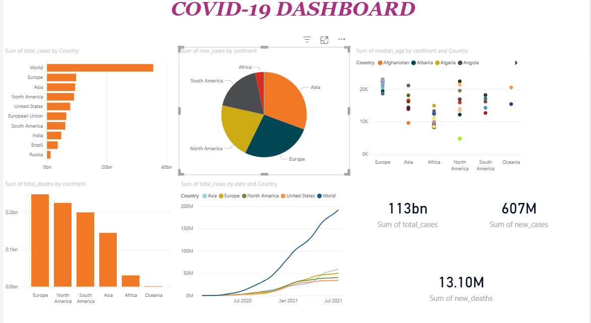

# covid19-data-analysis-dashboard
Analyzed COVID-19 data using Excel and Power BI to track trends, cases, recoveries, and deaths, and built an interactive dashboard for insights.
# COVID-19 Data Analysis Dashboard

## Objective
To analyze COVID-19 data and identify trends in confirmed cases, recoveries, and deaths.

## Tools Used
- Excel (data cleaning)
- Power BI (data visualization)

## Process
- Cleaned and structured raw COVID-19 dataset in Excel
- Handled missing values and formatted date columns
- Imported data into Power BI
- Created interactive dashboard with filters and KPIs

## Key Insights
- Peak infection periods were identified over time
- Certain regions showed higher case growth
- Recovery rates improved after specific periods

## Dashboard Preview

## Conclusion
This dashboard helps in understanding COVID-19 trends and supports data-driven insights for better decision-making.
